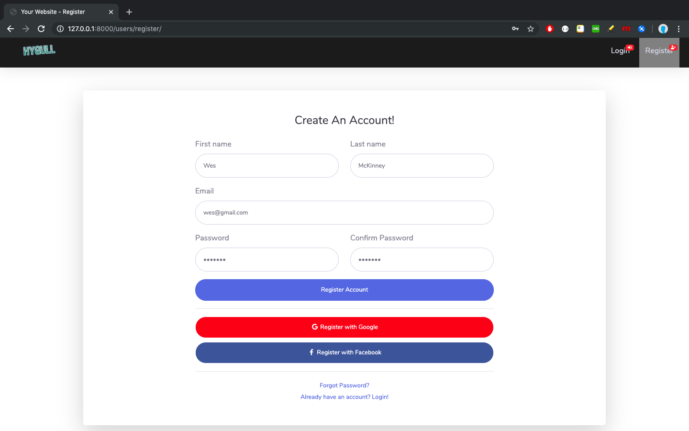
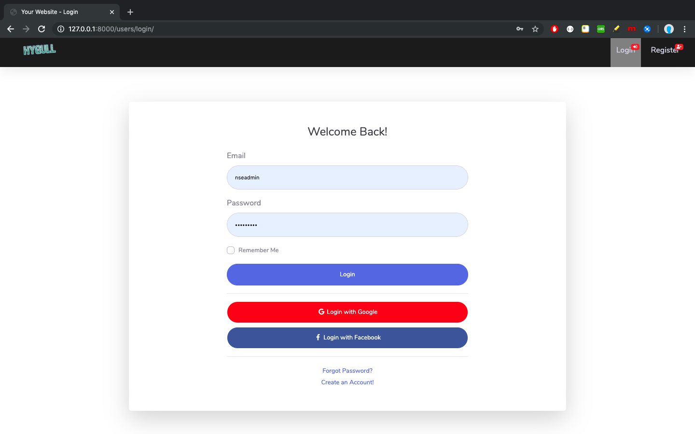
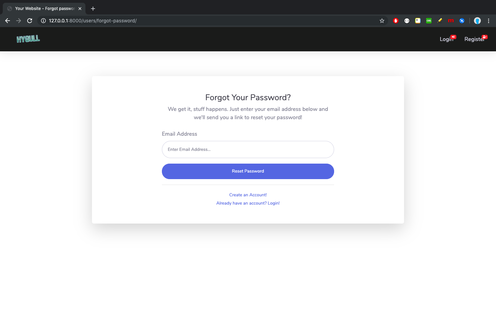
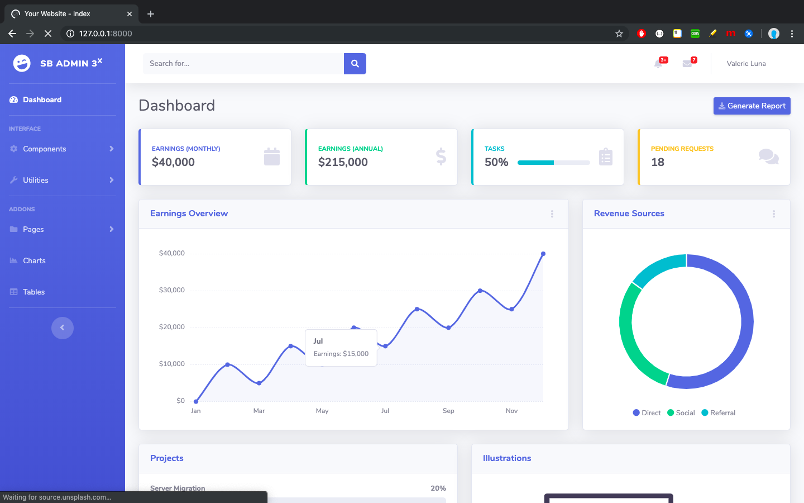
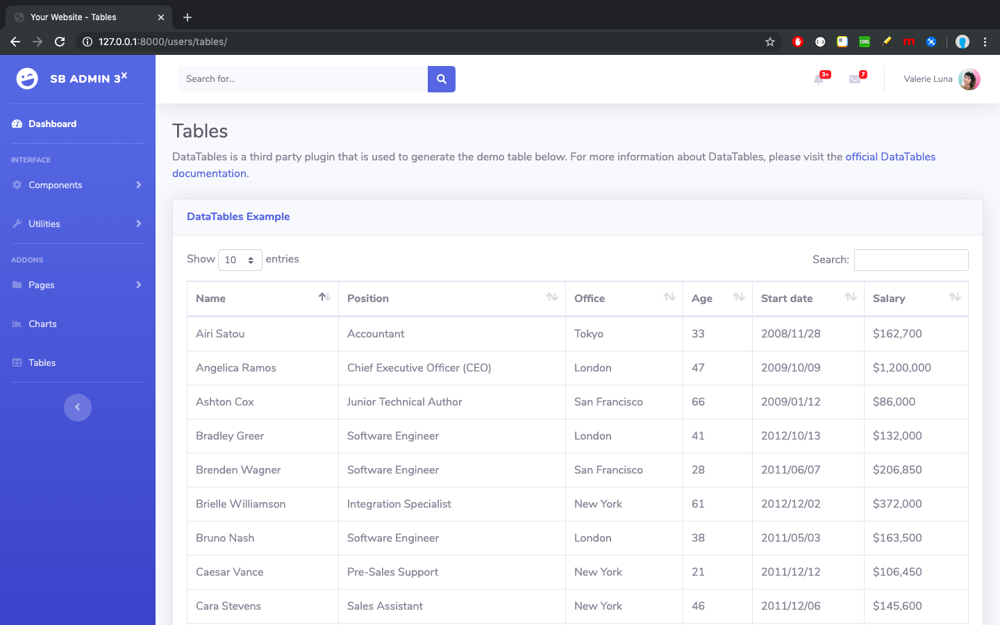
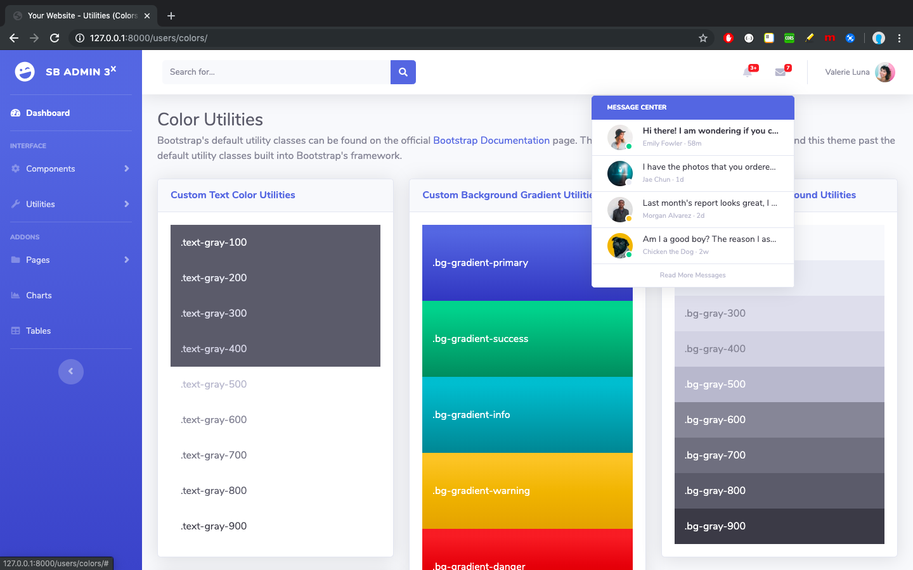
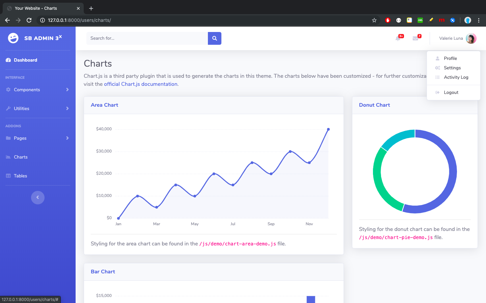

+ Python3+ installed in your system
+ **virtualenv** Python package is installed (It will allow you to run **virtualenv** command to create virtual environment)

Now, just follow the below steps to run this project. 

+ **`git clone https://github.com/hygull/sbadmin.git`**
+ **`virtualenv venv`** OR `python3 -m virtualenv venv`  OR `python3.6 -m virtualenv venv` etc.
+ **`source venv/bin/activate`** on Linux/MAC OS X, **`.\venv\Scripts\activate`** on Windows
+ **`cd sbadmin`**
+ **`pip install -r requirements.txt`**
+ **`cd src`**
+ **`python manage.py migrate`**
+ **`python manage.py runserver`**

Now, visit [http://127.0.0.1:8000](http://127.0.0.1:8000) and play. Later, you can write your own views and implement the functionality.

<h2 id="screenshots">Screenshots</h2>

Here are few scrennshots related to the integrated theme.

> ### Register

> ### Login

> ### Forgot Password

> ### Dashboard

> ### Tables

> ### Colors & Notifications

> ### Charts

Thanks for going through the documentation.
